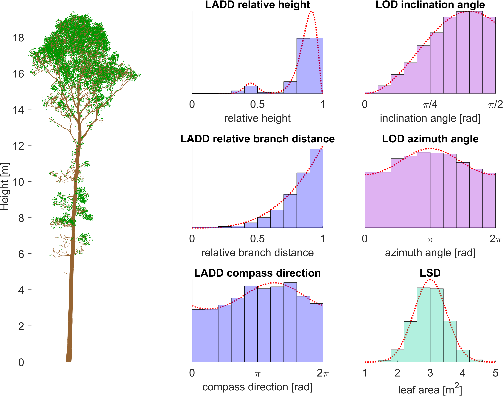

# LeafGen: Foliage generation in 3D tree models

LeafGen is a MATLAB package containing methods for generating virtual foliage on 3D tree models based on parametric leaf distributions.

To get started see the [documentation].

[documentation]: https://pietari-monkkonen.github.io/