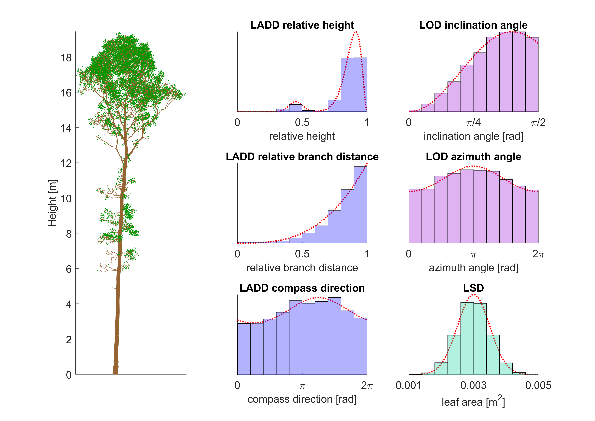
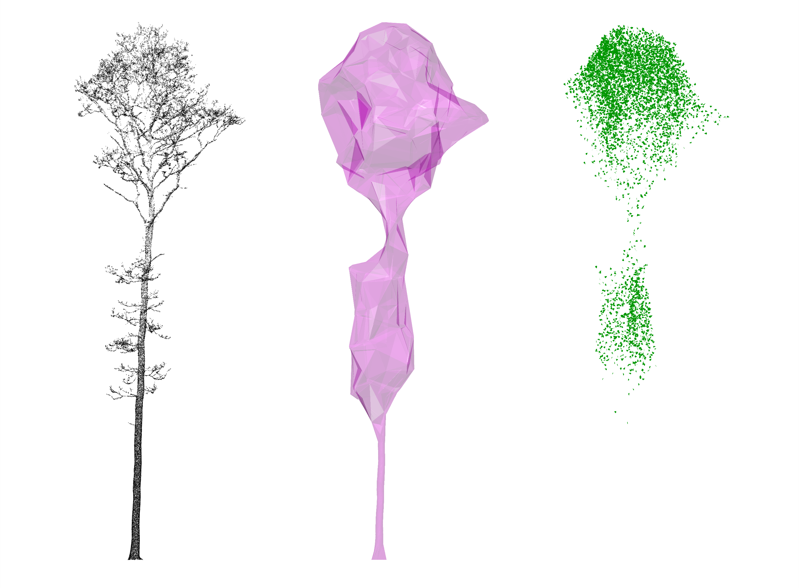

# LeafGen: Foliage generation for QSMs and point clouds

## Description

LeafGen is a MATLAB package containing methods for generating virtual foliage on 3D tree models based on parametric leaf distributions. The tree models can be either quantitative structure models (QSM) or point clouds of trees. The user can choose parametric distribution functions on variables of tree structure for the leaf area density distribution (LADD), leaf orientation distribution (LOD), and leaf size distribution (LSD).

## Documentation

The general LeafGen framework is presented in the following article

- Mönkkönen P, Van den Broeck W, Ali-Löytty S, Calders K, and Raumonen P (2025). *LeafGen*: Foliage Generation in 3D Tree Models. Methods in Ecology and Evolution. In Press. https://doi.org/10.1111.2041-210X.70080.

For technical details and guidance on usage, see the [LeafGen documentation].

## Quick start guide

To quickly test running the method:

1. Download or copy the LeafGen repository to your computer.
2. Open MATLAB and set the main path to the `src` directory of the LeafGen repository
3. Open and run one of the three main files in MATLAB (preferably start with either `main_qsm_direct.m` or `main_canopy_hull.m`, as the `main_leaf_cylinder_library.m` requires a long computation.)

To view a detailed tutorial on each of these files and more, see the  [LeafGen documentation].

[LeafGen documentation]: https://pietari-monkkonen.github.io/